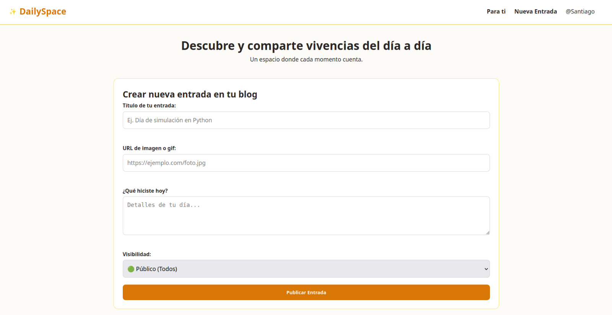
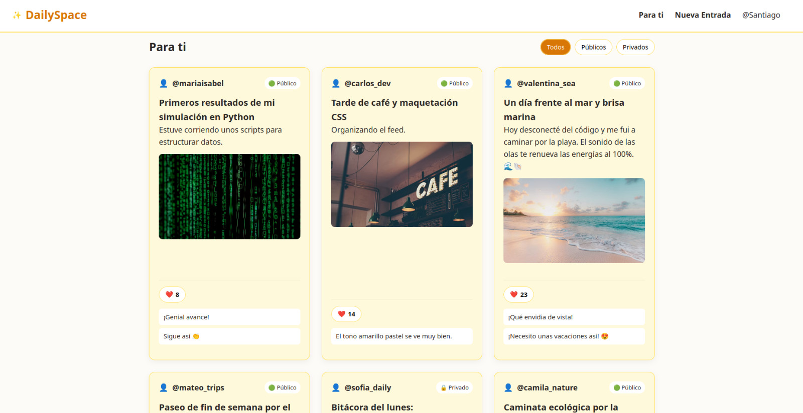
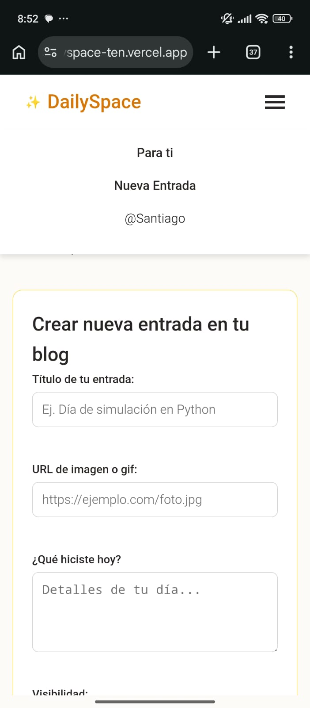
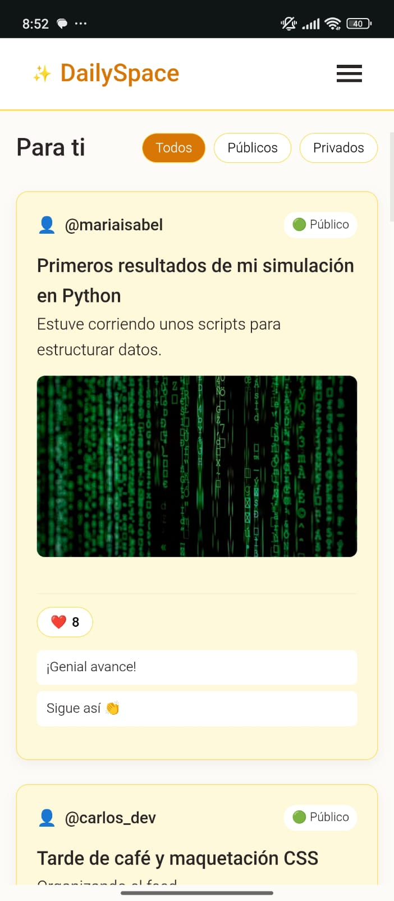

# DailySpace — Tu Diario Digital e Interactivo

**Estudiante:** María Isabel Zuluaga Quintero  
**Curso:** Desarrollo Web (Semestre 2026-2)  
**Despliegue en Vercel:** [https://dailyspace-ten.vercel.app/](https://dailyspace-ten.vercel.app/)

---

## 📝 Descripción del Proyecto
DailySpace es un sitio web interactivo diseñado para llevar una bitácora o diario personal. Permite redactar publicaciones, configurar visibilidad pública o privada y explorar el feed comunitario "Para ti" con interacción de me gusta y comentarios.

---

## 🛠️ Decisiones Técnicas

### ¿Dónde usaste Flexbox y dónde Grid, y por qué?
* **CSS Grid:** En la sección `.posts-grid` para organizar las tarjetas amarillas del catálogo en columnas adaptables (3 columnas en escritorio, 1 en móvil).
* **Flexbox:** En la barra de navegación (`.main-header`), encabezados de tarjetas y el modal de login para alinear elementos unidireccionales.

### ¿Qué hace tu JavaScript y cómo funciona la validación?
1. Renderiza dinámicamente el catálogo desde un arreglo de objetos.
2. Valida formularios en tiempo real mostrando mensajes bajo los campos con `` sin usar `alert()`.
3. Responde a eventos `click` e `input` para actualizar Likes y agregar comentarios.

### ¿Cómo usaste la Inteligencia Artificial?
Como tutor para resolver dudas sobre la configuración del layout responsive y optimizar la semántica HTML5.

### ¿Qué fue lo más difícil y cómo lo resolviste?
Mantener sincronizado el renderizado del DOM al agregar comentarios o dar Likes sin perder la lista original de publicaciones.

## 📸 Capturas de Pantalla

### Vista previa desde PC

  
   
  

### Vista previa desde Móvil

  
  &nbsp;&nbsp;&nbsp;&nbsp;
  

